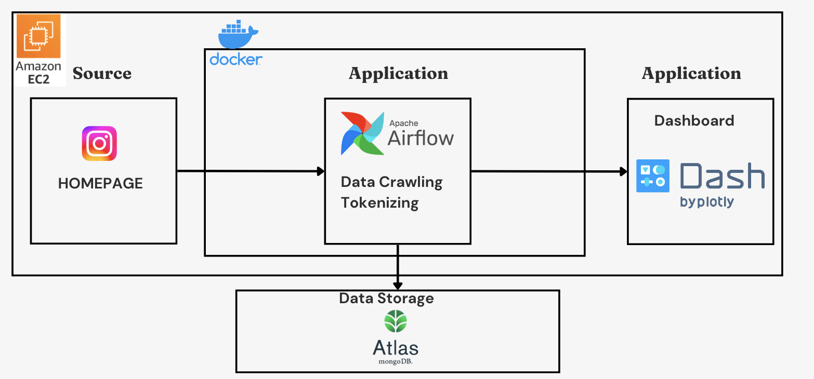
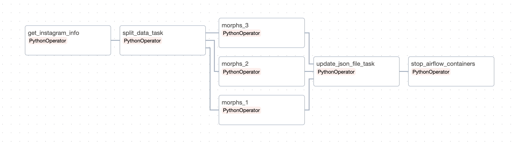

# Startup ConnectsLab pilot project

**Team Members**: 최준용, 강성구, 이상호, 곽준목

## **프로젝트 개요**

- **프로젝트 목표**: Instagram에서 #육아일기 데이터를 크롤링 및 Dashboard 작성

- **기간**: 23.11.15 ~ 23.12.20

 

### 프로젝트 기술스택

 

 
 
 

 

### **Overview**

- 생애초기(0-4세)는 뇌 신경망의 발달이 폭발적으로 일어나는 시기이다.

- 이 시기에 다양한 외부 자극을 접하고 소화하며 아이들의 두뇌가 성장한다.

- 가장 중요한 외부 자극 중 하나가 ‘부모의 말’ 이다.

- 한 가정에서 아이가 성장하는 동안의 대화내용을 담은 음성파일이 회사측에 존재 하지 않는다.

- 필요로하는 데이터와 유사한 데이터는 Instagram의 **#육아일기** 라고 판단하였다.

- Instagram의 데이터로 추후 고객들에게 보여질 Dashboard를 구상하고 확인하기 위한 프로젝트.

 

### **1st Step.**

Instagram에서 유사한 데이터 크롤링

* **데이터 수집**
  * Web으로 인스타그램에서 #육아일기 를 검색했을때 15개의 게시물로 제한되어있다.
  * META에서 Instagram graph API를 사용하여 보았지만 데이터 수집을 위한 API가 아니라 광고를 목적으로 한 API라 판단
  * 대안책으로 꾸준히 업데이트를 하는 유저의 계정을 수작업으로 선별 후 선별된 계정의 게시물 크롤링
    
* **데이터 적재**
  * 데이터베이스의 전체적 관리 맡아주는 MongoDB의 관리형 클라우드 서비스 Atals선택
  * pymongo를 이용하여 MongoDB에 적재
  * 컬렉션 - insta_crawling, insta_crawling_morphs

* **데이터 처리**
  * 적재된 데이터에서 본문 내용을 Tokenizing(Okt) *이모티콘, 의성어가 많아 Okt 선택
  * Tokenizing된 데이터를 MongoDB에 적재
  * Dash를 이용하여 Dashboard 작성

### **2nd Step.**

추후 서비스에 Daily로 들어올 데이터를 위한 Pipeline 구성
>
> 

>
 

* **Docker**
  * 개발 환경, 테스트 환경, 그리고 프로덕션 환경 간에 일관성 있게 애플리케이션을 배포하기 위하여 사용

* **데이터 수집**
  * 선별된 계정에서 하루 전날 업데이트 된 데이터만 크롤링하는 코드로 수정(instagram_job)

* **데이터 적재**
  * daily_data 컬렉션을 추가하여 daily로 들어오는 data를 적재(database.py)
 
* **데이터 처리**
  * daily_data를 Tokenizing후 insta_crawling_morphs 컬렉션에 저장(morphs_job.py, database.py)

* **자동화**
  * airflow를 사용하여 매일 9시 데이터 수집, 적재, 처리 후 Dashboard 업데이트

### **3rd Step.**

개인적으로 airflow의 기능을 사용해고자 병렬처리, xcom 사용

> 

* **airflow** (미완성)
  * airflow의 다양한 기능을 사용해보고싶어 Task 간에 데이터를 전달하는 Xcom 사용
  * 크롤링 시간을 단축하기 위해 크롤링 코드 병렬처리를 하였지만 계정 차단 이슈로 실패
  * tokenizing 코드를 병렬처리 진행중

